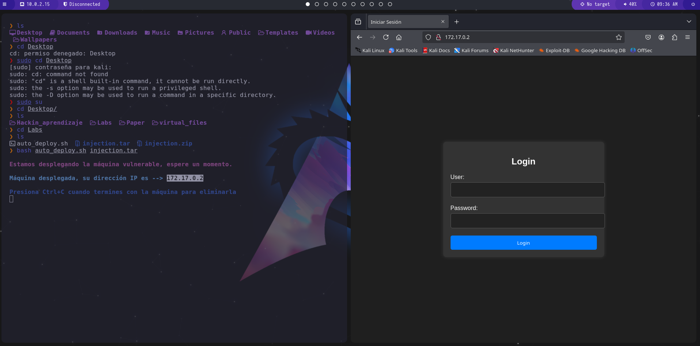

# Injection SQL Dockerlabs

## se procedio a desplegar la maquina


## Escaneo con nmap

<p>se Realizo un escaneo de puertos, servicios y versiones con el siguiente comando.</p>

```
nmap 172.17.0.2

```

<p>encontrando los puertos ssh port 22 y http port 80 abiertos</p>


<p>Se abrio la ip en el navegador la cual arroja un login</p>



<p>Se procedio a realizar una inyección SQL simple colocando admin y password 'OR 1=1--' tambien la realizamos como usuario ' or 1=1; -- y password numeros aleatorios 123q y en las cuales 2 pruebas tuvimos acceso obteniendo el bypass</p>


### ssh

<p>procedimos a realizar la conexion en ssh teniendo el acceso a la maquina</p>

```
ssh dylan@172.17.0.2

```


<p>Despues de tener acceso se busco a ver que se encontraba pero sin exito hasta que me tuve que fijar que hacer y procedi a ejecutar el bin env convirtiendome en root</p>

## root


